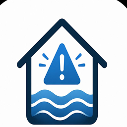

# CrueVeille pour Home Assistant

**Description courte:** integration Home Assistant de surveillance Vigicrues/Hub'Eau pour anticiper les crues locales et declencher des alertes inondation selon une position, une station hydrometrique et des seuils configures.

Integration personnalisee Home Assistant qui surveille une station hydrometrique Vigicrues/Hub'Eau proche d'une position et genere une alerte locale de risque d'inondation.

Elle utilise l'API Hydrometrie Hub'Eau, dont les mesures temps reel proviennent de la plateforme HYDRO Centrale operee par le Service Central Vigicrues. Les hauteurs sont publiees en millimetres et les debits en litres par seconde par l'API; l'integration les convertit en metres et m3/s.

## Fonctionnalites

- Recherche automatique de la station la plus proche d'une latitude/longitude dans un rayon configurable.
- Possibilite de forcer un code station Vigicrues.
- Capteurs Home Assistant:
  - hauteur d'eau;
  - debit;
  - vitesse de montee en cm/h;
  - hauteur projetee sur quelques heures;
  - niveau de risque local;
  - distance de la station.
- Capteur binaire `Alerte inondation` active quand le niveau de risque atteint le seuil choisi.

## Installation manuelle

1. Copier le dossier `custom_components/vigicrues_alert` dans le dossier `custom_components` de Home Assistant.
2. Redemarrer Home Assistant.
3. Aller dans `Parametres > Appareils et services > Ajouter une integration`.
4. Chercher `Vigicrues Alert`.

## Installation avec HACS

Le depot est compatible avec une installation HACS comme depot personnalise:

1. Ouvrir HACS dans Home Assistant.
2. Aller dans `Integrations`.
3. Ouvrir le menu puis `Depots personnalises`.
4. Ajouter `https://github.com/vico34/crueveille`.
5. Choisir la categorie `Integration`.
6. Installer `CrueVeille`, puis redemarrer Home Assistant.

Lien direct:

Pour une inclusion dans les depots HACS par defaut, le depot doit rester public, avoir une description, des topics, les GitHub Actions HACS/Hassfest au vert, puis une release GitHub complete avant la demande d'ajout dans `hacs/default`.

## Configuration

Vous pouvez configurer l'integration de deux facons:

- par position: latitude, longitude et rayon de recherche;
- par code station: le code exact d'une station hydrometrique Vigicrues.

Les seuils de hauteur sont optionnels, car ils dependent du repere local de chaque station. Pour une alerte fiable, renseignez au minimum:

- `Seuil hauteur vigilance (m)`;
- `Seuil hauteur critique (m)`;
- `Hausse vigilance (cm/h)`;
- `Hausse critique (cm/h)`.

Sans seuil de hauteur, l'integration alerte uniquement sur la vitesse de montee et la tendance projetee.

## Limites importantes

Cette integration ne remplace pas les bulletins officiels Vigicrues, les consignes prefectorales, les alertes FR-Alert ou les dispositifs communaux. Elle produit un signal domotique local a partir des mesures disponibles et de seuils que vous configurez.

L'API Hub'Eau Hydrometrie expose des mesures quasi temps reel et non une prevision officielle de zone inondee. La "hauteur projetee" est une extrapolation simple de tendance recente.

Sources:

- API Hydrometrie Hub'Eau: https://hubeau.eaufrance.fr/page/api-hydrometrie
- Vigicrues: https://www.vigicrues.gouv.fr/
